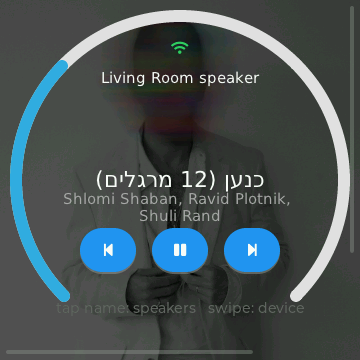

# ESP32-S3 Cast Knob

A physical volume/transport controller for **Google Cast (Chromecast) speakers**,
built on the [Waveshare ESP32-S3-Knob-Touch-LCD-1.8](https://www.waveshare.com/wiki/ESP32-S3-Knob-Touch-LCD-1.8).

Turn the knob to change volume. Press it to pick a speaker, long-press to mute.
On-screen buttons handle play / pause / next / previous, and the round display
shows what's playing — title, artist, and the album cover as a dimmed backdrop.

<p align="center">
  
</p>
<p align="center"><em>dial = volume · press = speaker list · long-press = mute · swipe = speaker</em></p>

## Status

✅ **Working firmware.** Discovers and controls Cast speakers end-to-end:
now-playing, volume/mute, transport, speaker switching, groups, album art, and
Wi-Fi provisioning. See [Features](#features) and the [roadmap](docs/06-roadmap.md).

## Features

- **Volume & mute** — turn the knob (a per-speaker colored ring follows it);
  long-press to mute.
- **Switch speakers** — press the knob (or tap the name) for a scrollable list,
  or swipe left/right. Recently-used speakers stay warm, so switching back is
  instant.
- **Now playing** — title, artist, play state, and the **album cover** shown as
  a dimmed background. Non-Latin titles (e.g. Hebrew, RTL) render correctly.
- **Transport** — on-screen previous / play-pause / next, enabled per what the
  app supports.
- **Cast groups** — multi-room groups are discovered and controllable.
- **Wi-Fi setup on-device** — QR + captive portal, no rebuild (see below).

## Quick start

Prerequisites: [`uv`](https://docs.astral.sh/uv/) and [`just`](https://github.com/casey/just).
PlatformIO itself is installed *into a uv-managed venv* — you do **not** need a
global PlatformIO.

```bash
just setup          # create .venv via uv, install pinned PlatformIO into it
just doctor         # (optional) check toolchain + detected serial ports
just build          # compile the firmware
just flash          # build + upload to the board (USB-C, S3 side — see below)
just monitor        # watch serial logs
just dev            # build + upload + monitor in one shot
```

Run `just` with no arguments to list every recipe. First build downloads the
ESP-IDF toolchain and managed components, so it takes a few minutes; later builds
are seconds.

On first power-up the knob boots, joins Wi-Fi (or starts the setup portal — see
below), discovers your Cast speakers over mDNS, and lands on the now-playing
screen for the first speaker. Then use it as described in the [User guide](#user-guide).

### Wi-Fi setup (on-device, no rebuild)

On first boot (no saved network) the screen shows a **QR code**. Scan it to join
the device's `CastKnob-XXXX` setup network, then a web form (at `192.168.4.1`)
opens — enter your home Wi-Fi name + password and **Save & Connect**. The creds
are stored in NVS and reused on every boot; a Wi-Fi icon shows connection status.
(For development you can instead `cp include/secrets.h.example include/secrets.h`
to compile creds in.)

### Flashing note — dual-MCU USB

The board muxes one USB-C between the **ESP32-S3** (native USB, `/dev/ttyACM*`)
and a secondary **ESP32** (CH340 bridge, `/dev/ttyUSB*`). `platformio.ini` pins
uploads to the `ttyACM*` (S3) side. If a flash hits the wrong chip, replug USB or
enter download mode (hold **BOOT**, tap **RESET**, release **BOOT**).

## User guide

The round screen is the now-playing view for the **active speaker**. All of these
work from there:

| Action | Do this |
|--------|---------|
| **Change volume** | Turn the knob. The colored ring shows the level and updates instantly; the speaker follows. |
| **Mute / unmute** | Long-press the knob (the ring turns red while muted). |
| **Pick a speaker** | Press the knob, or tap the speaker name. A list appears — **turn** the knob to scroll, **press** to select (or tap a row). Tap outside / wait to dismiss. |
| **Next / previous speaker** | Swipe left / right on the screen. |
| **Play / pause, next, previous** | Tap the on-screen buttons. Buttons dim when the app doesn't support them. |

Notes:

- **Instant switch-back.** The few most-recently-used speakers stay connected, so
  returning to one is immediate (no reconnect). A brand-new speaker shows
  "connecting…" for ~½ second.
- **Per-speaker color.** Each speaker gets its own volume-ring color, so you can
  tell at a glance which one you're on.
- **Album art & titles.** The cover art loads in the background (a moment after
  the track) and dims behind the text. Titles in any script — including
  right-to-left (Hebrew) — render correctly.
- **Live updates.** If someone else changes the volume or skips a track, the
  screen reflects it.
- **Groups.** Cast multi-room groups appear in the list like any speaker; the
  knob controls the group volume.

## How it works (one paragraph)

The ESP32-S3 joins your Wi-Fi, then uses **mDNS** to discover `_googlecast._tcp`
services on the LAN. For a selected speaker it opens a **TLS** socket to port
`8009` and speaks the **CASTV2** protocol (length-prefixed protobuf frames whose
payloads are JSON) to read media/volume status and send transport commands. The
knob, touchscreen, and a small **LVGL** GUI form the control surface. See
[docs/02-architecture.md](docs/02-architecture.md).

## Documentation

| Doc | What's in it |
|-----|--------------|
| [00 — Overview & goals](docs/00-overview.md) | Scope, MVP, non-goals |
| [01 — Hardware reference](docs/01-hardware.md) | Board, ICs, GPIO pin map |
| [02 — Firmware architecture](docs/02-architecture.md) | Tasks, modules, data flow |
| [03 — Cast protocol](docs/03-cast-protocol.md) | mDNS, CASTV2, namespaces, message flows |
| [04 — UI / UX](docs/04-ui-ux.md) | Knob + touch interaction model, LVGL screens |
| [05 — Build & tooling](docs/05-build-and-tooling.md) | uv + Just + PlatformIO workflow |
| [06 — Roadmap](docs/06-roadmap.md) | Milestones & open questions |
| [07 — Testing](docs/07-testing.md) | Trace capture + native unit tests (planned) |

## Toolchain

- **[uv](https://docs.astral.sh/uv/)** — owns the Python venv that PlatformIO runs in.
- **[just](https://github.com/casey/just)** — task runner (`just setup`, `just flash`, …).
- **[PlatformIO](https://platformio.org/)** — build/flash toolchain (**ESP-IDF** framework).
- **[ESP-IDF](https://docs.espressif.com/projects/esp-idf/)** — `esp-tls`, `mdns`, `cJSON`, drivers.
- **[LVGL 9](https://lvgl.io/)** — embedded GUI (via `esp_lvgl_port`).

## Prior art / references

We don't start from scratch — these inform the design (see
[docs/02-architecture.md](docs/02-architecture.md#prior-art--what-we-borrow)):

- **[ESPCaster](https://github.com/amitn/ESPCaster)** — same author's ESP-IDF
  Chromecast discovery + control + LVGL stack (on a different board). Primary
  reference for the Cast layer.
- **[EmbeddedWizard BSP](https://github.com/EmbeddedWizardGUI/ESP32-S3-Knob-Touch-LCD-1.8-EN)**
  — ESP-IDF BSP for *this exact board*; source of the confirmed pin map.
- **[BlueKnob](https://github.com/joshuacant/BlueKnob)** — BLE media remote on
  this board; source of the **SH8601** display driver + BSP components (touch,
  backlight PWM, encoder).
- **[roon-knob](https://github.com/muness/roon-knob)** — Roon controller on this
  board (close analog: media transport + volume over the network).
- **[ihayri dev-board examples](https://github.com/ihayri/ESP32-S3-1.8inch-Knob-Display-Development-Board)**
  and **[VolosR/Knob18Meters](https://github.com/VolosR/Knob18Meters)** — more
  display/UI examples for this exact board.
